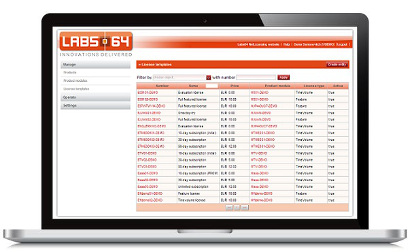
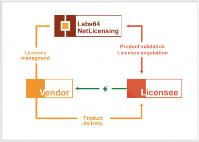

    

        <h1>Move your Licensing to the Cloud</h1>
        Labs64 NetLicensing is a first-class solution in the Licensing as a Service (LaaS) sector.
            Based on open standards, it provides a cost effective, integrated and scalable platform for software vendors
            and developers who want to concentrate on their product’s core functionality instead of spending resources
            on developing an own license management software.
        <a href="https://netlicensing.labs64.com/app/v2/?lc=4b566c7e20&source=lmbox001"
           class="NL_button button_main NL_banner_btn" role="button"><i class="fa fa-eye"></i>Live Demo</a>
    

    

        <section class="cbp-so-section">
            <article class="cbp-so-side cbp-so-side-left">
                <h2>Be flexible</h2>

                With NetLicensing you have a choice of ready-to-use licensing models or customized licensing models
                    may be created to suit your unique business needs and goals.
                    NetLicensing has an open architecture that allows easy extension with new licensing models.
            </article>
            <figure class="cbp-so-side cbp-so-side-right">
                
            </figure>
        </section>

        <section class="cbp-so-section">
            <figure class="cbp-so-side cbp-so-side-left">
                
            </figure>
            <article class="cbp-so-side cbp-so-side-right">
                <h2>Streamline purchasing process</h2>

                NetLicensing provides a seamless online purchase experience, aligned with the deployed licensing
                    models. Our PayPal integration allows your global customers to pay in their preferred currency.
                
            </article>
        </section>

        <section class="cbp-so-section">
            <article class="cbp-so-side cbp-so-side-left">
                <h2>Integrate fast</h2>

                NetLicensing makes setup and integration fast, safe and very simple. 
                    So you can get up and running in a few hours.

                

                    

                    

                    
<i>As easy as one, two, three!</i>

                

            </article>
            <figure class="cbp-so-side cbp-so-side-right">
                
            </figure>
        </section>

        <section class="cbp-so-section">
            <figure class="cbp-so-side cbp-so-side-left">
                
            </figure>
            <article class="cbp-so-side cbp-so-side-right">
                <h2>Activate over the Internet</h2>

                NetLicensing allows you to deliver and activate product licenses to your customers 24x7x365, without
                    customer support involvement. With NetLicensing, your licensing back-office can be completely
                    automated. In addition, you can manage licenses in the field with NetLicensing Manage.
            </article>
        </section>
    

    

        

            <h2>Signup for a NetLicensing account</h2>
            Join the hundreds of happy NetLicensing customers

            <form action="https://netlicensing.labs64.com/app/v2/content/register.xhtml" method="GET"
                  name="register" id="register"
                  novalidate>
                <button type="submit" class="NL_button button_main NL_banner_btn" style="max-width: 400px;">
                    <i class="fa fa-user-plus"></i>Start Your Free License Management
                </button>
            </form>
        

    

